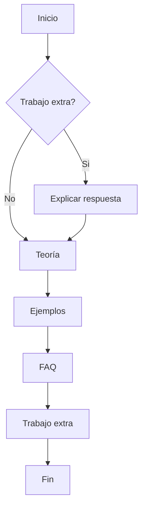

---
# Common-Defined params
title: "50.00 Fundamentos de Arquitectura de Software"
date: "2025-04-05T23:00:26Z"
lastmod: "2025-04-05T23:00:26Z"
description: "Fuí invitado a hacer un curso para Platzi sobre Arquitectura de Software, es una oportunidad de ayudar a personas en muchas partes, es una oportunidad de crecimiento personal, es una oportunidad que no puedo dejar pasar."
lead: "El syllabus de un curso de Platzi. Por qué enseñar? Para quién? Cúal es mi apuesta?" # Lead text
thumbnail: "img/posts/fundamentalist-dogma.jpg" # Thumbnail image
lang: es
categories:
  - "50 Fundamentos de Arquitectura de Software"
tags:
  - "Platzi"
draft: false
asciinema: false
menu: side # Optional, add page to a menu. Options: main, side, footer
comments: false # Enable Disqus comments for specific page
authorbox: true # Enable authorbox for specific page
pager: true # Enable pager navigation (prev/next) for specific page
next: 50.01-architectura-era-ai
toc: true # Enable Table of Contents for specific page
sidebar: "right" # Enable sidebar (on the right side) per page
widgets: # Enable sidebar widgets in given order per page
  - "search"
  - "recent"
  - "taglist"
  - "social"
---

Fuí invitado a hacer un curso para Platzi. Qué espero exponer? Cómo funcionará el curso? Pueden opinar...

<!--more-->

## Pre-requisitos

Este curso trata de ser lo más inclusivo posible en el ámbito técnico, sin embargo, es necesaria una mínima preparación para poder sacar algo de provecho de las lecciones expuestas. En términos generales el curso espera que cada estudiante tenga los siguientes FUNdamentos:

- Programación básica (No importa el lenguaje de programación, aunque estoy [pensando en Python](https://github.com/espinoza/ThinkPython2-spanish/blob/master/book/thinkpython2-spanish.pdf))
- Diagramación básica (i.e. diagramas de flujo, probablemente [draw.io](https://app.diagrams.net/) basta)
- Sistemas de control de versiones básicos (Git esta [ok](https://git-scm.com/book/en/v2/Getting-Started-What-is-Git%3F))

## Estilo de cada clase

Las clases siguen el modelo estándar de Platzi, videos cortos con información empaquetada de forma accesible, sin embargo, cada video espero estructurarlo de la siguiente manera:

cada video espero dejarlo entre 7 y 10 minutos (+/- 2 minutos) para que no sea una clase magistral. Cada trabajo extra es sólo una sugerencia para trabajar las destrezas que esperamos desarrollar en el curso y mis respuestas personales no necesariamente son prescriptivas.

## Orientación del curso

Este curso no es 100% practico, es decir, no vamos a asumir que todos los conceptos que esperamos tratar ya se encuentran aprendidos y que vamos a aplicar el adagio _"la práctica hace al maestro"_. En su lugar vamos a explicar una corta base teórica/conceptual, desarrollar un corto ejemplo en el video y resolver preguntas usuales. Finalmente propondremos un ejercicio personal que será documentado en este espacio.

### Trabajo extra

Los trabajos extra serán sencillos, generalmente con poco código (en su inmensa mayoria [vibe-coding](https://en.wikipedia.org/wiki/Vibe_coding)) y más diagramación/escritura. La idea es trabajar en un repositorio individual un proyecto personal durante toda la duración del curso que sea retador pero no un gran peso/compromiso.

### Referencias

Cada clase incluirá un post en este blog con referencias y contenido extra que no alcance a preparar para el video correspondiente. Es un trabajo enorme previo pero creo que vale la pena en pro de ampliar los recursos de aprendizaje. Las referencias permiten identificar puntos de profundización/aclaración y ayudan a establecer el tono de la conversación.

### Actualizaciones

Con base en los comentarios recibidos en este blog o en la plataforma de aprendizaje espero actualizar/complementar/corregir el contenido. 

## Syllabus

La estructura del curso esta dividida en cinco (5) módulos que arrancan de forma abstracta con el contexto de la disciplina de Arquitectura de Software, continúa con las consideraciones básicas sobre frugalidad y huella medioambiental necesarias para tomar en cuenta el medio ambiente al diseñar soluciones basadas en Software, sigue con un acercamiento a la estructura del Software como perspectiva fundamental de la Arquitectura de Software, avanza hacia la aplicación de bases sólidas de diseño y termina con una exploración de las métricas mínimas que un arquitecto usa para medir el impacto de su trabajo. Finalmente, un par de capitulos sobre cuestiones practicas acerca del curso. 

El syllabus propuesto se encuentra en el siguiente archivo que enlaza a cada _post_ que contiene los recursos extras propuestos. 


